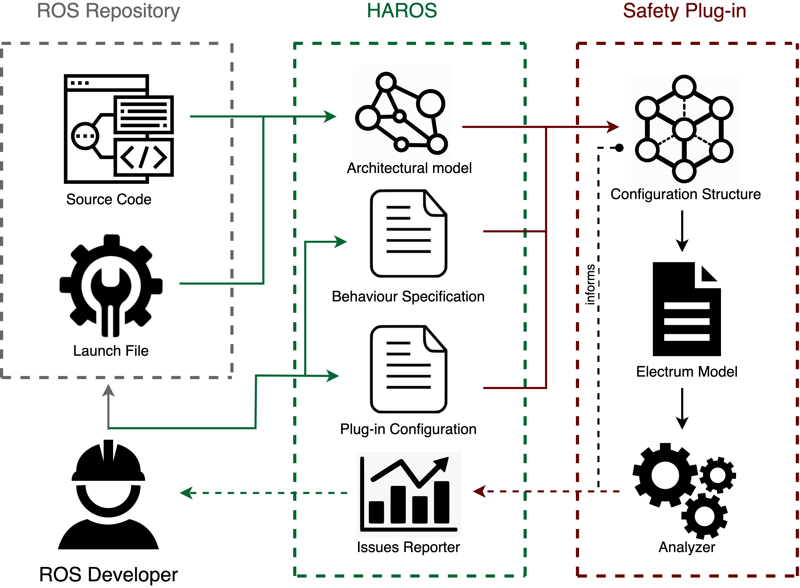

# HAROS Model-Checking Plugin

Model-Checking Plugin for HAROS

-------------------------------

This open-source plugin developement process, description, and validation was published at IROS2020, [here](http://ras.papercept.net/images/temp/IROS/files/1158.pdf).

The system-wide Architecture of the HAROS safety plug-in for ROS





## Installation

### Requirements

Before using the plugin, it's required to install [HAROS](https://github.com/git-afsantos/haros) and its plugins.
Afterthat, just clone the repository and execute the following commands:

```bash
git clone https://github.com/brfc/haros_plugin_mc.git
```

Install the python requirements, which script is placed on the repository root:

```bash
pip install -r requirements.txt
```
Finally, just enter the root folder and execute:

```bash
cd ~/haros_plugin_mc
sudo python setup.py
```

The command above will create the cache folders and place the auxiliary artifacts on it.

-------------------------------

### Usage

The plugin requires a yaml configuration file. Here it is possible to define generic plugin configurations, 
as well as the plugin required configurations, as the verification `scopes`. Otherwise, inocous default scopes will be used.

The repository includes a configuration file model:

```bash
cd ~/haros_mc_plugin/plugin.yaml
```

The HAROS specification must be placed in the `yaml` project file. The `~/haros_plugin_mc/mc/sample/sample.yaml`
illustrates how the specification must be written.

Afterwards, just run it as any other HAROS plugin. The following command illustrates how the analysis of the `sample` is executed.

```bash
haros full -p ~/haros_plugin_mc/mc/sample/sample.yaml
```

-------------------------------

### Acknowledgment
this work was financed by the ERDF – European Regional Development Fund through the Operational Programme for Competitiveness and Internationalisation - COMPETE 2020 Programme and by National Funds through the Portuguese funding agency, FCT - Fundação para a Ciência e a Tecnologia
